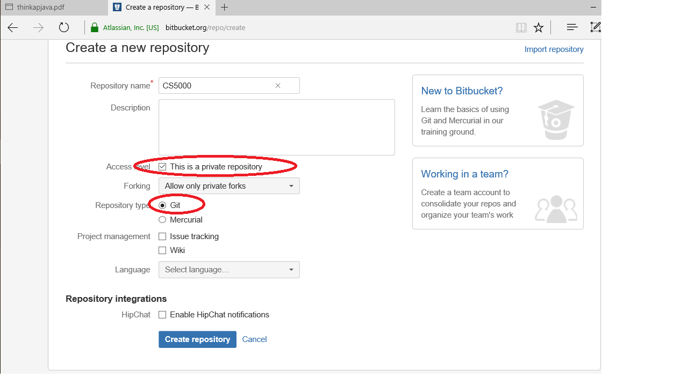
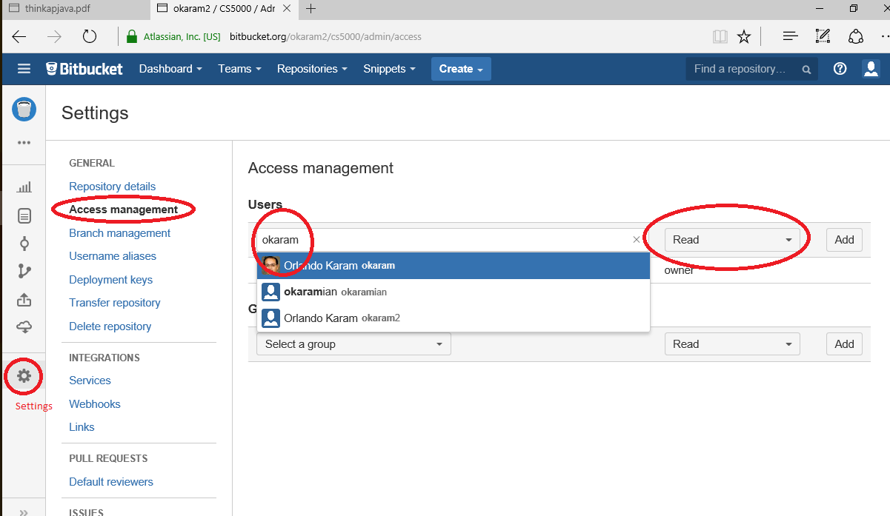

Required Setup
===

These instructions are written for Windows (and tested on a Windows 10 machine). Please ask if you're using a different OS.

For the first couple of weeks we will use web applications instead of requiring you to install software, giving you a little time to install everything. It is OK to feel stressed, as you need to install several things, and the instructions cannot be perfect since we don't know which specific versions of things you get; take a deap breath .... and anohter ... and ask if you need help (both in D2L and directly emailing me). 

# Installing JDK

The Java Development Kit (JDK) includes a Java compiler, standard library and virtual machine; You can download Oracle's JDK from [http://www.oracle.com/technetwork/java/javase/downloads/index.html](http://www.oracle.com/technetwork/java/javase/downloads/index.html).

Download some version of Java 8 (they have extra numbers like 8u65, those minor numbers are not terribly important). Notice you have to download and install the JDK, not just the JRE.

# Installing Eclipse

We will use Eclipse as our prefered IDE (we're lucky there are many free good IDEs for java :), I chose Eclipse more or less arbitrarily :)

You want some version of the Eclipse IDE for Java Developers; unless your machine is really old, chances are you're running a 64 bit version :). As of Jan 9, you can find the [latest version here](http://www.eclipse.org/downloads/download.php?file=/technology/epp/downloads/release/mars/1/eclipse-java-mars-1-win32-x86_64.zip). You can go to [their page](http://www.eclipse.org/downloads/packages/eclipse-ide-java-developers/mars1) for more info.

Eclipse doesn't really come with an installer; just open the zip file (double-click on it on File explorer; works on Windows, Linux and Mac), and copy to the folder of your choice. 

# Installing a git client

We will use BitBucket as our code repository, but you still need a git client. The command line client is available at [www.git-scm.com](http://www.git-scm.com/downloads). You can also get a GUI client; I've used [SourceTree](https://www.sourcetreeapp.com/). I assume you have a command line client.

# BitBucket setup

Go to [Bitbucket.org](https://bitbucket.org/) and create an account. Then create a repository (there's a create button on the top bar). You can name the repository any way you want, but I suggest a name like CS5000 (notice different users can have repos with the same name); make sure the repo is private and uses git.

After you create the repository, give me read access so I can see your code (go onto settings, there's an icon at the bottom of the left-hand bar). My account name is okaram; I only need read access.

