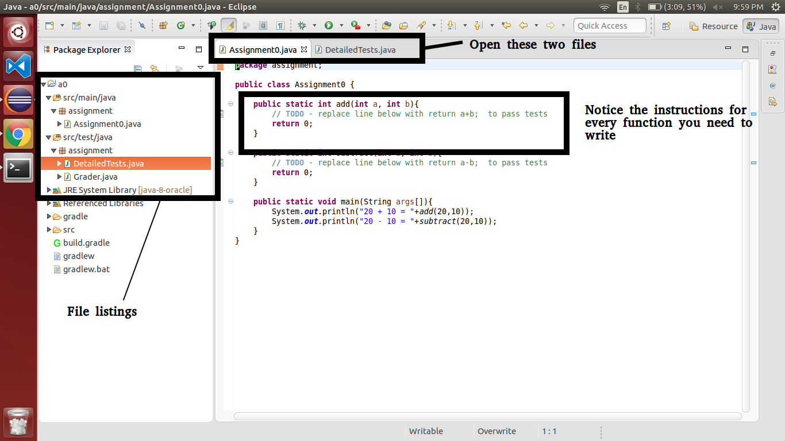

Assignment 0 - Sample
===

Remember, the first thing to do is to GET YOUR BITBUCKET account, and let me know immediately, so you can work on the assignment. 

Assignments are submitted by pull-request, to a repo I create for you. After you tell me your bitbucket username, then I will send you an email with your repo, and instructions.

This assignment is officially due on Sunday, Aug 21 @ 11:59 pm, with a grace period until Tuesday, Aug 23 @ 11:59pm.

This assumes you have created a projects folder on your Documents folder, and cloned your repo to it. It assumes you have run ./mkEclipse.sh. It also assumes you have imported the projects into eclipse (see [video](https://youtu.be/yu1ktwKXJWo).


## Going to your folder
Open your git-bash console, and type:
```cd ~/Documents/projects/cs5000```

## Create a new branch, called a0
```
git checkout -b a0
```

Notice after you have created the branch, you should do ```git checkout a0``` without the -b. ```git status``` shows you which branch you are on, and ```git branch``` shows which branches are available.

## Run tests

I provide unit tests that check your assignment works; you will normally start by running these tests and seeing them fail, and continuosly implement pieces of functionality and running the tests again; if it all works, you should pass more tests each time.

You can run the tests two different ways; using [gradle](http://gradle.org), an automated build system, or using [eclipse](http://eclipse.org), an Integrated Development Environment.

To start, run ```./gradlew test``` to run all unit tests. You will see a bunch of messages, including some about tests failing.

You can also run ```./gradlew grade``` which will give you an idea about your possible grade.

## Run tests with eclipse

Start eclipse, and open the a0 project. There is a folder src, with two subfolders, main and test. Open the following two files: 
+ src/main/java/assignment/Assignment0.java
+ src/test/java/assignment/DetailedTests.java

Look at the code for Assignment0.java; notice it tells you to make some changes. 



Do not worry about the code for DetailedTests.java, but select it and run it. You will see it executes several unit tests, and they will all be red (failing). We will now do changes and see how the tests pass.


Select Assignment0.java again and do the first modification; make add return a+b 
```java
	public static int add(int a, int b){
		// TODO - replace line below with return a+b;  to pass tests 
		return a+b
	}
```

Then go to DetailedTests, and run again. Now two tests should pass.

Now go change Assignment0 again, and fix subtract; run tests again ... lather, rinse, repeat until all tests pass.

Notice that if you prefer to use a different editor rather than eclipse, you can always use ```./gradlew grade``` to run the tests.

## Gradle grade again

Just to make sure, run the grader again; go back to git-bash and run ```./gradlew grade``` ; you should see all tests pass.

When all the tests pass, get ready for submit.

## Adding and commiting

+ Use ```git status``` to make sure you are in the right branch
+ then ```git add . --all``` to add all your changes.  
+ then use ```git commmit -m "assignment 0"``` to commit your changes

## pushing
```git push origin a0```

And then follow instructions to send a pull request.

This assignment is for practice and will not be graded; however, you need to do this before attempting assignment 1. This assignment is due Wednesday, June 8 @ 6:30 pm. 
